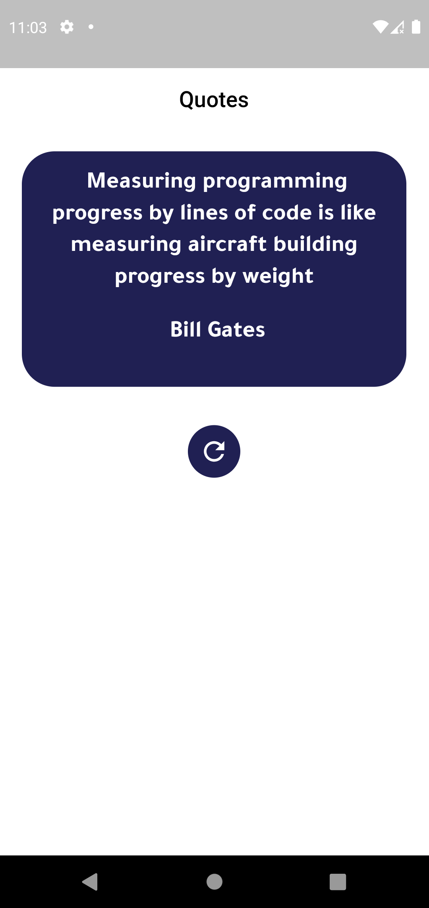
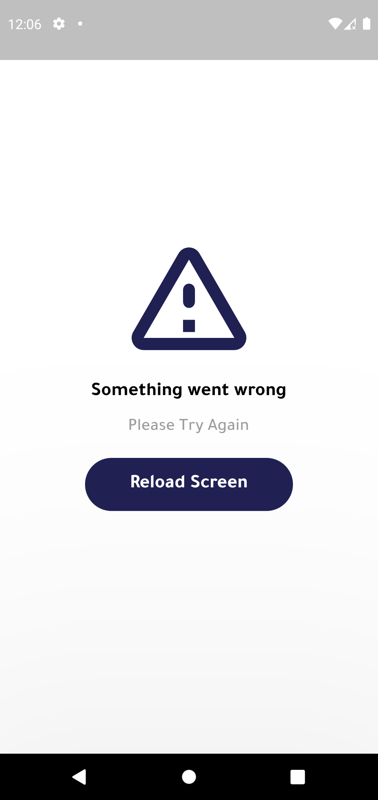

# Random Quote - Clean Architecture for Flutter

## The Clean Architecture

## Reso Coder's Flutter Clean Architecture Proposal

## Project Structure

# Screen Shots

![Random Quote]

--------------------------------------------------------------------------------------------------------------------------------
--------------------------------------------------------------------------------------------------------------------------------
![Error]

--------------------------------------------------------------------------------------------------------------------------------

# PROJECT LICENSE

This project was submitted by Mostafa Hassan

Me, the author of the project, allow you to check the code as a reference, but if you submit it, it's your own responsibility if you get expelled.

Copyright (c) 2023 Mostafa Hassan
